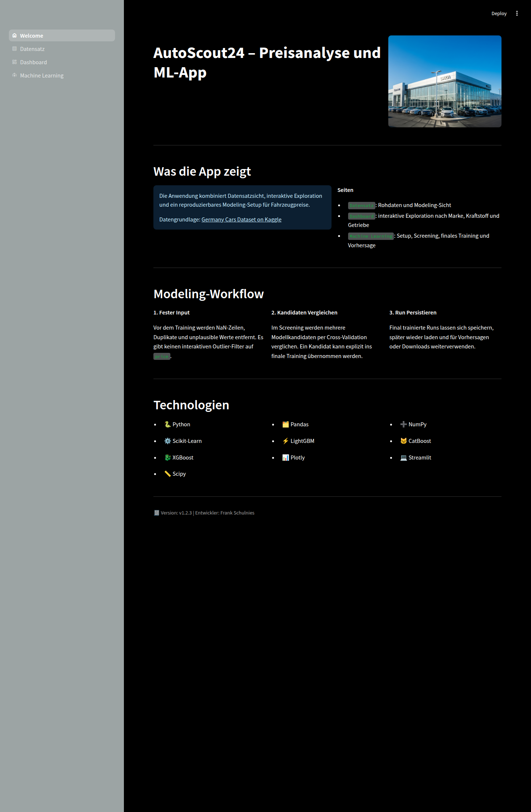
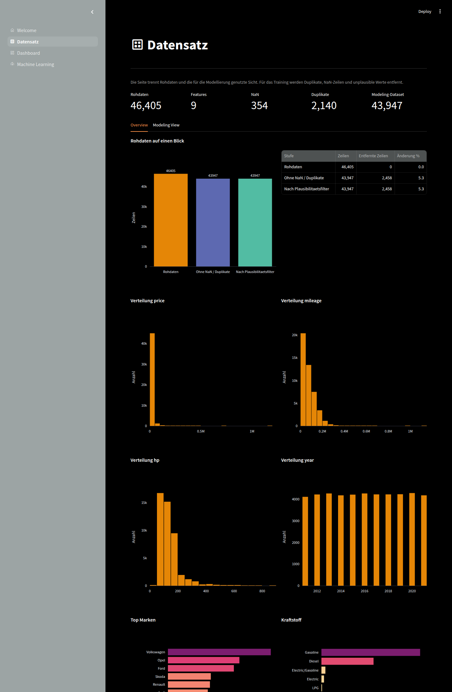
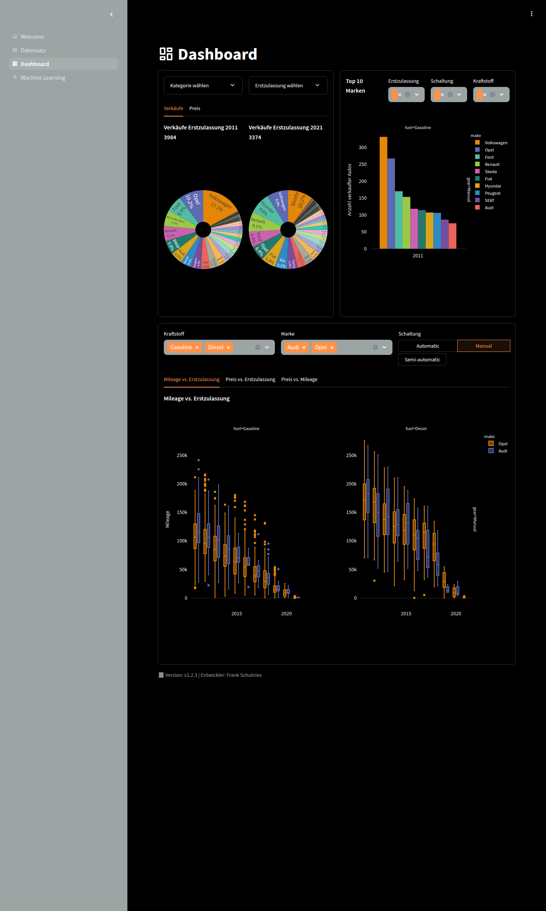

# AutoScout24 App

Streamlit-App zur Exploration von Fahrzeugdaten und zum Training von Modellen für die
Preisvorhersage.

## Funktionen

- Datensatzansicht mit Rohdaten und aktueller Modeling-Sicht
- Dashboard für Exploration nach Marke, Kraftstoff, Getriebe und Jahr
- ML-Workflow mit Setup, Kandidaten-Screening und finalem Training
- Persistenz gespeicherter Trainings-Runs unter `models/runs/`
- Vorhersagen und Download von Artefakten aus gespeicherten Runs

## Insights

### Welcome



### Datensatz



### Dashboard



## Voraussetzungen

- Python `3.12`
- Git
- optional: Docker

## Lokale Installation

```bash
git clone https://github.com/Franky-11/autoscout24-app.git
cd autoscout24-app

python3.12 -m venv .venv
source .venv/bin/activate

pip install --upgrade pip
pip install -r requirements.txt
```

App lokal starten:

```bash
streamlit run src/home.py
```

Die App ist dann unter `http://localhost:8501` erreichbar.

## Entwicklung

Optionale Dev-Tools installieren:

```bash
pip install -e ".[dev]"
```

Nützliche Befehle:

```bash
PYTHONPATH=src pytest
PYTHONPATH=src ruff check src tests
```

## Docker Schnellstart

Image bauen:

```bash
docker build -f src/Dockerfile -t autoscout24-app .
```

### Variante 1: Schnell starten ohne persistente Runs

```bash
docker run --rm -p 8501:8501 autoscout24-app
```

Die App läuft dann unter `http://localhost:8501`.

### Variante 2: Mit persistenter Run-Ablage

```bash
mkdir -p models/runs

docker run --rm \
  -p 8501:8501 \
  -v "$(pwd)/models/runs:/app/models/runs" \
  autoscout24-app
```

Damit bleiben gespeicherte Trainings-Runs auch nach dem Stoppen des Containers erhalten.

## Speicherung von Runs

- Lokal speichert die App Runs unter `models/runs/`
- Im Container ist der Pfad `/app/models/runs`
- Ohne Docker-Volume bleiben Runs nur im Dateisystem des Containers

## Projektstruktur

```text
autoscout24-app/
├── assets/
├── data/
├── models/
│   └── runs/
├── src/
│   ├── Dockerfile
│   ├── home.py
│   └── autoscout24/
├── tests/
├── pyproject.toml
├── requirements.txt
└── README.md
```

## Lizenz

MIT, siehe `LICENSE`.
